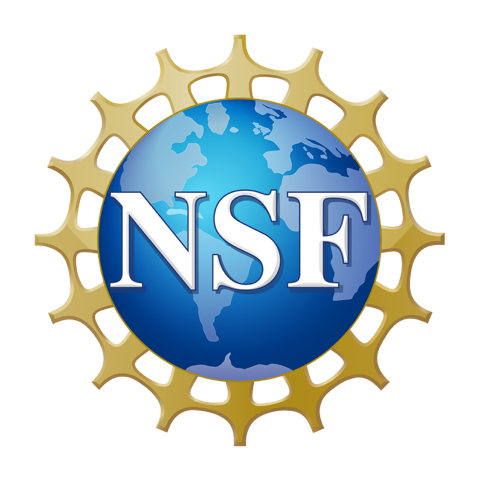
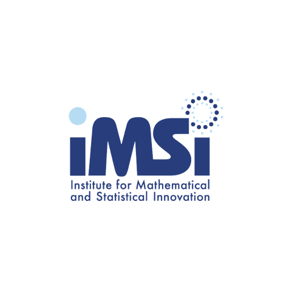
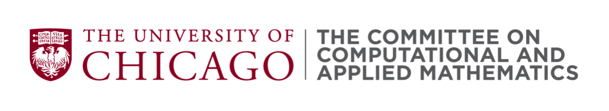
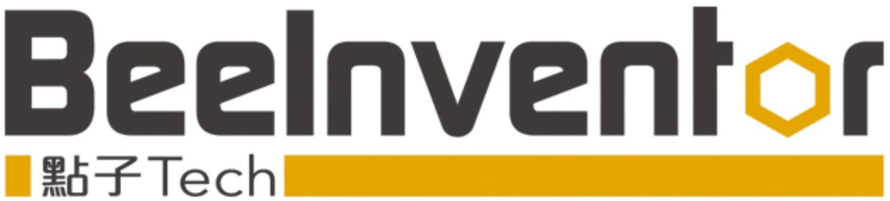

The conference is sponsored by the:

* [Institute for Mathematical and Statistical Innovation](https://www.imsi.institute), 
a US National Science Foundation research institute based at the University of Chicago

* [Illinois Institute of Technology](https://www.iit.edu/)

* [Committee on Computational and Applied Mathematics](https://cam.uchicago.edu/) at the University of Chicago

* [Argonne National Laboratory](https://www.anl.gov/)

* [NYU Courant Institute](https://cims.nyu.edu/)

* [BeeInventor: IoT for Smart Construction](https://www.beeinventor.com/)

