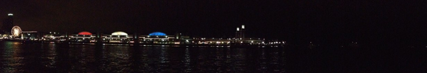

# Conference Location

MCM 2025 will take place in Chicago. Greater Chicago is home to several research universities and two United States Department of Energy research laboratories.  Chicago is a major transportation hub, which will facilitate scholars from all over the world coming together to share the latest developments in Monte Carlo methods.

The conference will be held at Hermann Hall at the Mies campus of the Illinois Institute of Technology, which is situated a few miles south of downtown and accessible by public transportation. See [directions to IIT](https://www.iit.edu/about/campus-information/mies-campus) and the [IIT Campus Map](https://www.iit.edu/about/campus-information/mies-campus/mies-campus-map). 

# Lodging

We have negotiated a special rate with Le Méridien Essex Chicago for $249.00 USD + tax per night.  This hotel is not far from the Illinois Tech campus and near several attractions in downtown Chicago. To book a room at the conference rate, use [this link](https://www.marriott.com/event-reservations/reservation-link.mi?id=1734631273407&key=GRP&guestreslink2=true&app=resvlink).

# Travel support

We will provide travel support for some early career scholars through our sponsor, IMSI.  [Apply on their website here](https://www.imsi.institute/activities/15th-international-conference-on-monte-carlo-methods-and-applications-mcm/).  We will start notifying successful applicants soon after February 28.

## Campus

## From 31st street beach, near campus

